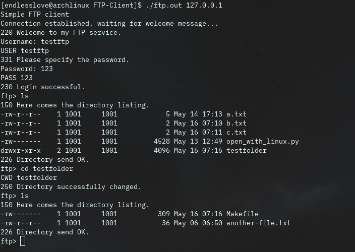
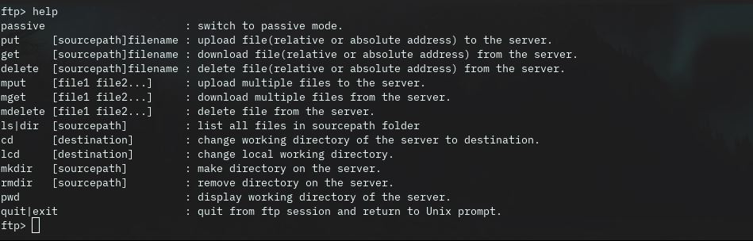

# A simple FTP Client implementation in C++

### A project in Computer Networking course
#### Department: Information Technology department, Ho Chi Minh University of Science.
#### Class code: CQ2016/4
####  Names and roll numbers:
[Lê Minh Nghĩa 1612423](https://github.com/endless-love)

[Nguyễn Đăng Anh Thi 1612645](https://github.com/dkakashi69)

### Platform: Linux(only)

### Structure: OOP(Object Oriented Programming)

### Run
    $ ./ftp.out <host>

### Demo
     
### Rebuild

    $ git clone git@github.com:dkakashi69/FTP-Client.git
    $ make

It's recommendable start the client connection from other directory to see the transfer of files between server and client.

### Implementations

- Login/logout
- Supoort both active and passive mode
- Upload files
- Download files
- Get directory location
- Change directory
- Rename files/directories
- Delete files
- Create/delete directories
- List files in directory

### Commands

